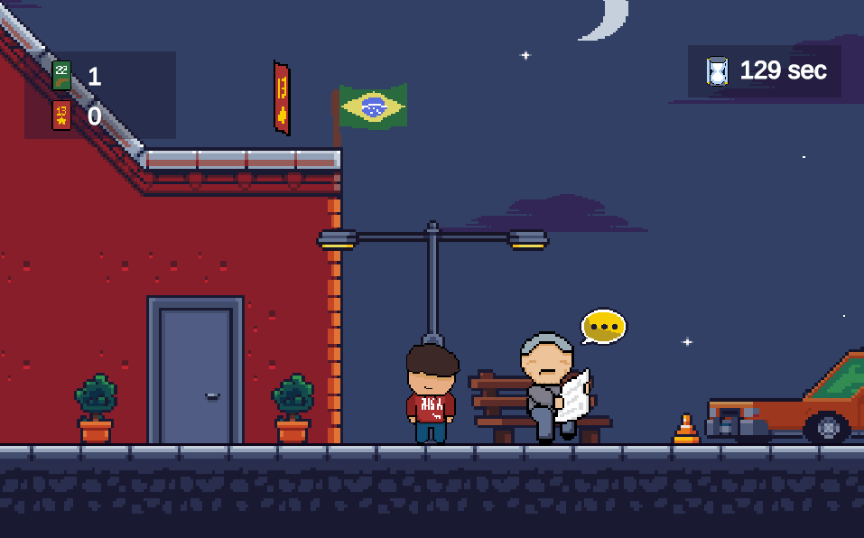

# Brazilian Fake news

## Authors

Jorge KORGUT Junior

## Game  

You play as a young Brazilian citizen on a quest for information to make an informed vote. Throughout your day, you will meet various characters who share their opinions and facts related to the candidates. You have limited time to explore, so be quick and strategic to gather as much information as possible. Also, keep an eye on your voting cards, because once the exploration ends, you will need to vote on each piece of information you have collected. To do this, you will need enough cards matching your choices.

## Controls
Use **◀ ▲ ▼ ▶** to move the character

Press **SPACE** to interact

Press **ENTER** to fast-forward conversations
